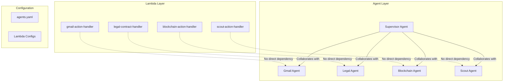

# Patchline Architecture Vision

## Current Architecture (Decoupled Design)

### Overview
We've successfully decoupled Lambda functions from Bedrock Agents, breaking the circular dependency that previously existed.



### Key Benefits

1. **Independent Deployment**: Lambda functions can be deployed without knowing agent IDs
2. **Agent Context from Events**: Agent information is passed at runtime through event context
3. **Flexible Updates**: Can update Lambda code or agent prompts independently
4. **No Circular Dependencies**: Clean deployment order: Lambdas → Agents → Collaborations

## Future Vision: Intelligent Agent Management

### Phase 1: Command-Line Management Tool
```bash
# Update agent prompt
patchline agent update gmail --prompt "New instructions here..."

# Add Lambda functionality
patchline lambda add-function legal textract-processor

# Deploy specific components
patchline deploy lambda scout-action-handler
patchline deploy agent blockchain

# Test agents
patchline test agent supervisor "Send $50 to wallet ABC123"
```

### Phase 2: Self-Managing Agent System
```yaml
# Future agents.yaml with advanced features
gmail:
  name: PatchlineEmailAgent
  model: us.anthropic.claude-sonnet-4-20250514-v1:0
  prompt: prompts/gmail-agent.md
  capabilities:
    - email_search
    - email_send
    - email_draft
    - calendar_integration  # Auto-generates Lambda code
  auto_update: true
  learning_enabled: true
```

### Phase 3: Natural Language Infrastructure Management
```python
# Future: Talk to your infrastructure
patchline_cli.execute("""
    I need to add a new capability to the legal agent that can:
    1. Extract text from PDF contracts using Textract
    2. Identify key clauses and risks
    3. Compare against our standard templates
    
    Please implement this and deploy it.
""")

# Response: 
# ✅ Created new Lambda function: legal-textract-analyzer
# ✅ Added Textract permissions to IAM role
# ✅ Updated legal agent prompt with new capabilities
# ✅ Deployed and tested successfully
```

## Implementation Roadmap

### Immediate (Now)
- [x] Decouple Lambda functions from agents
- [x] Create deployment scripts
- [x] Document architecture

### Short Term (1-2 weeks)
- [ ] Create `patchline` CLI tool
- [ ] Add prompt versioning
- [ ] Implement rollback capabilities
- [ ] Add comprehensive testing framework

### Medium Term (1-2 months)
- [ ] Auto-generate Lambda code from OpenAPI specs
- [ ] Implement agent performance monitoring
- [ ] Add A/B testing for prompts
- [ ] Create visual agent builder

### Long Term (3-6 months)
- [ ] Self-modifying agents
- [ ] Natural language infrastructure management
- [ ] Automatic optimization based on usage patterns
- [ ] Multi-region deployment support

## Technical Implementation Details

### Current Scripts
1. **deploy-all-lambdas.py**: Deploys Lambda functions independently
2. **clean-and-rebuild-agents.py**: Manages agent lifecycle
3. **setup-collaborations.py**: Configures agent relationships
4. **rebuild-everything.ps1**: Orchestrates complete rebuild

### Future CLI Structure
```
patchline/
├── cli/
│   ├── __init__.py
│   ├── agent.py      # Agent management commands
│   ├── lambda.py     # Lambda management commands
│   ├── deploy.py     # Deployment commands
│   └── test.py       # Testing commands
├── core/
│   ├── agent_manager.py
│   ├── lambda_manager.py
│   └── config_manager.py
└── templates/
    ├── lambda_templates/
    └── prompt_templates/
```

### Key Design Principles

1. **Separation of Concerns**: Each component has a single responsibility
2. **Configuration as Code**: Everything defined in YAML/JSON
3. **Idempotent Operations**: Scripts can be run multiple times safely
4. **Progressive Enhancement**: Start simple, add complexity as needed
5. **Developer Experience First**: Easy to understand and modify

## Example: Adding a New Agent

### Current Process
1. Add agent definition to `agents.yaml`
2. Create prompt file in `prompts/`
3. Create Lambda handler in `backend/lambda/`
4. Run `rebuild-everything.ps1`

### Future Process
```bash
patchline agent create social-media \
  --description "Manages social media posts and analytics" \
  --capabilities "post_content,analyze_metrics,schedule_posts" \
  --model "claude-4-sonnet"

# Automatically:
# - Generates Lambda functions
# - Creates OpenAPI schema
# - Writes initial prompt
# - Deploys everything
# - Adds to supervisor collaborators
```

## Conclusion

The decoupled architecture we've implemented provides a solid foundation for building an intelligent, self-managing agent system. By separating concerns and removing circular dependencies, we've created a system that's both powerful and maintainable.

The future vision focuses on developer experience, allowing infrastructure management through natural language while maintaining the flexibility to dive into code when needed. 