# 🚀 PATCHLINE: AI REBUILDING AI ARCHITECTURE

## 🎯 **Executive Summary**

Patchline represents a breakthrough in AI development - the world's first **AI-powered debugging system** that enables artificial intelligence to **rebuild and optimize itself**. Our multi-agent platform combines **zero-overhead debugging**, **real-time intelligence**, and **autonomous self-healing** to create AI systems that continuously evolve and improve.

---

## 📊 **1. Patchline Agentic Intelligence Platform**

Our comprehensive multi-agent system with intelligent debugging and real-world API integrations:

```mermaid
graph TB
    subgraph "🏢 PATCHLINE AGENTIC INTELLIGENCE PLATFORM"
        subgraph "🎯 MULTI-AGENT ORCHESTRATION"
            SUP["🧠 SUPERVISOR AGENT<br/>Master Coordinator"]
            SCOUT["🔍 SCOUT AGENT<br/>Music Intelligence"]
            GMAIL["📧 GMAIL AGENT<br/>Communication Hub"]
            BLOCKCHAIN["⛓️ BLOCKCHAIN AGENT<br/>DeFi Operations"]
            LEGAL["⚖️ LEGAL AGENT<br/>Compliance Engine"]
        end
        
        subgraph "🤖 INTELLIGENT DEBUG SYSTEM"
            subgraph "🎛️ ADAPTIVE LOGGING MODES"
                DEV["🔥 DEV MODE<br/>Full S3 + Console<br/>Real-time Insights"]
                PROD["⚡ PROD MODE<br/>Zero Overhead<br/>Errors Only"]
                EXTREME["🔬 EXTREME MODE<br/>Maximum Verbosity<br/>Deep Analysis"]
                OFF["🚫 OFF MODE<br/>Zero Logging<br/>Pure Performance"]
            end
            
            subgraph "🧠 AI-POWERED ANALYSIS"
                ANALYZER["🔍 LOG ANALYZER<br/>Pattern Recognition<br/>Anomaly Detection"]
                OPTIMIZER["⚙️ PERFORMANCE OPTIMIZER<br/>Auto-tuning<br/>Resource Management"]
                PREDICTOR["🔮 FAILURE PREDICTOR<br/>Proactive Alerting<br/>Self-healing"]
            end
        end
        
        subgraph "☁️ REAL-TIME DATA PIPELINE"
            S3["📊 S3 DEBUG STORAGE<br/>s3://patchline-files/debug-logs/<br/>Structured JSON Logs<br/>Real-time Streaming"]
            CLOUDWATCH["📈 CLOUDWATCH METRICS<br/>Performance Monitoring<br/>Alert Systems"]
            BEDROCK["🏗️ AWS BEDROCK<br/>Claude 3.5 Sonnet<br/>Intelligent Routing"]
        end
        
        subgraph "🌐 REAL-WORLD INTEGRATIONS"
            SOUNDCHARTS["🎵 SOUNDCHARTS API<br/>Live Music Data<br/>Artist Intelligence"]
            GMAIL_API["📬 GMAIL API<br/>Real Email Processing<br/>OAuth Authentication"]
            SOLANA["🪙 SOLANA RPC<br/>Blockchain Operations<br/>Real-time Prices"]
            SECRETS["🔐 AWS SECRETS<br/>Secure Credentials<br/>Auto-rotation"]
        end
    end
    
    subgraph "🚀 AI REBUILDING AI WORKFLOW"
        DETECT["🔍 DETECT<br/>Real-time Issue Detection<br/>Performance Bottlenecks"]
        ANALYZE["🧮 ANALYZE<br/>AI-powered Root Cause<br/>Pattern Recognition"]
        ADAPT["🔄 ADAPT<br/>Self-modifying Code<br/>Dynamic Optimization"]
        EVOLVE["🧬 EVOLVE<br/>Learning from Failures<br/>Continuous Improvement"]
    end
    
    subgraph "💼 INVESTOR VALUE PROPOSITION"
        ZERO_OVERHEAD["⚡ ZERO OVERHEAD<br/>Production Performance<br/>No Debug Tax"]
        REAL_TIME["🕐 REAL-TIME INSIGHTS<br/>Instant Problem Resolution<br/>Proactive Monitoring"]
        SELF_HEALING["🏥 SELF-HEALING<br/>Autonomous Recovery<br/>99.9% Uptime"]
        SCALABILITY["📈 INFINITE SCALE<br/>AWS Native<br/>Cost-optimized"]
    end
    
    %% Core Agent Connections
    SUP --> SCOUT
    SUP --> GMAIL
    SUP --> BLOCKCHAIN
    SUP --> LEGAL
    
    %% Intelligent Debug System Connections
    SCOUT --> DEV
    GMAIL --> DEV
    BLOCKCHAIN --> DEV
    LEGAL --> DEV
    
    DEV --> S3
    PROD --> CLOUDWATCH
    EXTREME --> ANALYZER
    
    %% AI Analysis Pipeline
    S3 --> ANALYZER
    ANALYZER --> OPTIMIZER
    OPTIMIZER --> PREDICTOR
    PREDICTOR --> SUP
    
    %% Real-world Integration
    SCOUT --> SOUNDCHARTS
    GMAIL --> GMAIL_API
    BLOCKCHAIN --> SOLANA
    SOUNDCHARTS --> SECRETS
    GMAIL_API --> SECRETS
    SOLANA --> SECRETS
    
    %% AWS Infrastructure
    SCOUT --> BEDROCK
    GMAIL --> BEDROCK
    BLOCKCHAIN --> BEDROCK
    LEGAL --> BEDROCK
    
    %% AI Rebuilding AI Flow
    ANALYZER --> DETECT
    DETECT --> ANALYZE
    ANALYZE --> ADAPT
    ADAPT --> EVOLVE
    EVOLVE --> SUP
    
    %% Value Proposition
    OPTIMIZER --> ZERO_OVERHEAD
    S3 --> REAL_TIME
    PREDICTOR --> SELF_HEALING
    BEDROCK --> SCALABILITY
    
    %% Styling
    classDef agentStyle fill:#667eea,stroke:#764ba2,stroke-width:3px,color:#fff
    classDef debugStyle fill:#f093fb,stroke:#f5576c,stroke-width:2px,color:#fff
    classDef aiStyle fill:#4facfe,stroke:#00f2fe,stroke-width:3px,color:#fff
    classDef infraStyle fill:#43e97b,stroke:#38f9d7,stroke-width:2px,color:#fff
    classDef valueStyle fill:#fa709a,stroke:#fee140,stroke-width:3px,color:#fff
    classDef workflowStyle fill:#a8edea,stroke:#fed6e3,stroke-width:2px,color:#333
    
    class SUP,SCOUT,GMAIL,BLOCKCHAIN,LEGAL agentStyle
    class DEV,PROD,EXTREME,OFF,ANALYZER,OPTIMIZER,PREDICTOR debugStyle
    class BEDROCK aiStyle
    class S3,CLOUDWATCH,SOUNDCHARTS,GMAIL_API,SOLANA,SECRETS infraStyle
    class ZERO_OVERHEAD,REAL_TIME,SELF_HEALING,SCALABILITY valueStyle
    class DETECT,ANALYZE,ADAPT,EVOLVE workflowStyle
```

### **Key Features:**
- **Multi-Agent Orchestration**: 5 specialized agents working in harmony
- **Intelligent Debug System**: Zero-overhead production, full development visibility
- **Real-time Data Pipeline**: S3 structured logging with instant insights
- **Real-world Integrations**: Live APIs for music, email, and blockchain
- **AI Rebuilding AI**: Continuous learning and self-improvement cycle

---

## 🏆 **2. AI Rebuilding AI Competitive Platform**

Executive-level view of our breakthrough innovation and competitive advantages:

```mermaid
graph LR
    subgraph "🏆 PATCHLINE: AI REBUILDING AI PLATFORM"
        subgraph "🎯 INTELLIGENT AGENT ECOSYSTEM"
            A1["🧠 SUPERVISOR<br/>Master Orchestrator<br/>Decision Engine"]
            A2["🔍 SCOUT<br/>Music Intelligence<br/>Real Soundcharts API"]
            A3["📧 GMAIL<br/>Communication Hub<br/>Live OAuth Integration"]
            A4["⛓️ BLOCKCHAIN<br/>DeFi Operations<br/>Real Solana RPC"]
            A5["⚖️ LEGAL<br/>Compliance Engine<br/>Document Processing"]
        end
        
        subgraph "🤖 BREAKTHROUGH: ZERO-OVERHEAD DEBUG INTELLIGENCE"
            subgraph "⚡ PRODUCTION MODES"
                PM1["🚀 PROD MODE<br/>Zero Performance Tax<br/>Pure Speed"]
                PM2["🔥 DEV MODE<br/>Full Telemetry<br/>S3 Real-time Logs"]
                PM3["🔬 EXTREME MODE<br/>Deep Analysis<br/>ML-powered Insights"]
            end
            
            subgraph "🧠 AI-POWERED SELF-DIAGNOSIS"
                AI1["🔍 PATTERN DETECTION<br/>Anomaly Recognition<br/>Behavioral Analysis"]
                AI2["⚙️ AUTO-OPTIMIZATION<br/>Performance Tuning<br/>Resource Allocation"]
                AI3["🔮 PREDICTIVE HEALING<br/>Failure Prevention<br/>Proactive Recovery"]
                AI4["🧬 EVOLUTIONARY CODE<br/>Self-modifying Logic<br/>Continuous Learning"]
            end
        end
        
        subgraph "📊 REAL-TIME INTELLIGENCE PIPELINE"
            RP1["📈 S3 STRUCTURED LOGS<br/>JSON Streaming<br/>Instant Analysis"]
            RP2["🔄 LIVE FEEDBACK LOOP<br/>Agent ↔ Debug System<br/>Continuous Adaptation"]
            RP3["🎯 SMART ROUTING<br/>AWS Bedrock Integration<br/>Optimal Model Selection"]
        end
        
        subgraph "🌍 REAL-WORLD API MASTERY"
            API1["🎵 SOUNDCHARTS<br/>Live Music Data<br/>Artist Intelligence"]
            API2["📬 GMAIL<br/>Real Email Processing<br/>OAuth Authentication"]
            API3["🪙 SOLANA<br/>Blockchain Operations<br/>DeFi Integration"]
            API4["🔐 AWS SECRETS<br/>Secure Credentials<br/>Auto-rotation"]
        end
    end
    
    subgraph "💡 COMPETITIVE ADVANTAGES"
        ADV1["⚡ ZERO DEBUG TAX<br/>Production Performance<br/>No Overhead Penalty"]
        ADV2["🕐 REAL-TIME INSIGHTS<br/>Instant Problem Resolution<br/>S3 Streaming Logs"]
        ADV3["🏥 SELF-HEALING AGENTS<br/>Autonomous Recovery<br/>99.9% Uptime SLA"]
        ADV4["🧠 AI-POWERED DEBUG<br/>Pattern Recognition<br/>Predictive Maintenance"]
        ADV5["📈 INFINITE SCALABILITY<br/>AWS Native Architecture<br/>Cost-optimized Growth"]
    end
    
    subgraph "🔄 AI REBUILDING AI CYCLE"
        CYCLE1["🔍 OBSERVE<br/>Real-time Monitoring<br/>Behavioral Analysis"]
        CYCLE2["🧮 LEARN<br/>Pattern Recognition<br/>ML-powered Insights"]
        CYCLE3["🔄 ADAPT<br/>Code Optimization<br/>Performance Tuning"]
        CYCLE4["🧬 EVOLVE<br/>Self-improvement<br/>Continuous Enhancement"]
    end
    
    %% Agent Orchestration
    A1 --> A2
    A1 --> A3
    A1 --> A4
    A1 --> A5
    
    %% Debug Intelligence Flow
    A2 --> PM2
    A3 --> PM2
    A4 --> PM2
    A5 --> PM2
    PM2 --> RP1
    RP1 --> AI1
    AI1 --> AI2
    AI2 --> AI3
    AI3 --> AI4
    
    %% Real-time Pipeline
    RP1 --> RP2
    RP2 --> RP3
    RP3 --> A1
    
    %% API Integration
    A2 --> API1
    A3 --> API2
    A4 --> API3
    API1 --> API4
    API2 --> API4
    API3 --> API4
    
    %% Competitive Advantages
    PM1 --> ADV1
    RP1 --> ADV2
    AI3 --> ADV3
    AI1 --> ADV4
    RP3 --> ADV5
    
    %% AI Rebuilding AI Cycle
    AI1 --> CYCLE1
    CYCLE1 --> CYCLE2
    CYCLE2 --> CYCLE3
    CYCLE3 --> CYCLE4
    CYCLE4 --> A1
    
    %% Innovation Feedback
    AI4 --> CYCLE4
    ADV3 --> CYCLE1
    
    %% Styling for Executive Presentation
    classDef agentStyle fill:#667eea,stroke:#764ba2,stroke-width:4px,color:#fff,font-weight:bold
    classDef debugStyle fill:#f093fb,stroke:#f5576c,stroke-width:3px,color:#fff,font-weight:bold
    classDef aiStyle fill:#4facfe,stroke:#00f2fe,stroke-width:4px,color:#fff,font-weight:bold
    classDef pipelineStyle fill:#43e97b,stroke:#38f9d7,stroke-width:3px,color:#fff,font-weight:bold
    classDef apiStyle fill:#fa709a,stroke:#fee140,stroke-width:3px,color:#fff,font-weight:bold
    classDef advantageStyle fill:#ff9a9e,stroke:#fecfef,stroke-width:4px,color:#333,font-weight:bold
    classDef cycleStyle fill:#a8edea,stroke:#fed6e3,stroke-width:3px,color:#333,font-weight:bold
    
    class A1,A2,A3,A4,A5 agentStyle
    class PM1,PM2,PM3 debugStyle
    class AI1,AI2,AI3,AI4 aiStyle
    class RP1,RP2,RP3 pipelineStyle
    class API1,API2,API3,API4 apiStyle
    class ADV1,ADV2,ADV3,ADV4,ADV5 advantageStyle
    class CYCLE1,CYCLE2,CYCLE3,CYCLE4 cycleStyle
```

### **Competitive Differentiation:**
- **Zero Debug Tax**: Production performance without debug overhead
- **Real-time Insights**: Instant problem resolution via S3 streaming
- **Self-healing Agents**: Autonomous recovery with 99.9% uptime
- **AI-powered Debug**: Pattern recognition and predictive maintenance
- **Infinite Scalability**: AWS-native, cost-optimized architecture

---

## 🏗️ **3. Technical Architecture Deep-dive**

Detailed technical view of our smart debug factory and production ecosystem:

```mermaid
graph TD
    subgraph "🚀 PATCHLINE TECHNICAL ARCHITECTURE"
        subgraph "🎭 INTELLIGENT AGENT LAYER"
            BEDROCK["🏗️ AWS BEDROCK<br/>Claude 3.5 Sonnet<br/>Multi-model Routing"]
            
            subgraph "🤖 AGENT INSTANCES"
                SUP["🧠 SUPERVISOR<br/>8VG8LOVLNZ"]
                SCOUT["🔍 SCOUT<br/>W00SGH6WWS"]
                GMAIL["📧 GMAIL<br/>YOMXXWPSSQ"]
                BLOCKCHAIN["⛓️ BLOCKCHAIN<br/>W8H34DMCA5"]
                LEGAL["⚖️ LEGAL<br/>SOZZFV6SYD"]
            end
        end
        
        subgraph "💡 BREAKTHROUGH: SMART DEBUG FACTORY"
            subgraph "🎛️ DEBUG MODE INTELLIGENCE"
                FACTORY["🏭 get_logger() FACTORY<br/>Automatic Mode Detection<br/>Zero-config Intelligence"]
                
                NOOP["🚫 NoOpLogger<br/>Production Mode<br/>Zero CPU Cycles<br/>Zero Memory"]
                DEV["🔥 DevDebugLogger<br/>Development Mode<br/>S3 + Console Logging<br/>Real-time Insights"]
                PROD["⚡ ProdLogger<br/>Production Errors<br/>Critical Issues Only<br/>Minimal Overhead"]
            end
            
            subgraph "🧠 ADAPTIVE BEHAVIOR"
                ENV_DETECT["🔍 Environment Detection<br/>DEBUG_MODE Auto-sensing<br/>Runtime Adaptation"]
                PERF_OPT["⚙️ Performance Optimization<br/>Branch Prediction<br/>Memory Efficiency"]
                CONTEXT_AWARE["🎯 Context-aware Logging<br/>Agent-specific Routing<br/>Intelligent Filtering"]
            end
        end
        
        subgraph "☁️ REAL-TIME DATA ARCHITECTURE"
            subgraph "📊 S3 STRUCTURED STORAGE"
                S3_LOGS["📈 S3 Debug Logs<br/>s3://patchline-files/debug-logs/<br/>├── scout-agent/2025/06/09/<br/>├── gmail-agent/2025/06/09/<br/>└── blockchain-agent/2025/06/09/"]
                
                JSON_STRUCT["📋 JSON Log Structure<br/>{<br/>  'timestamp': '2025-06-09T14:30:15',<br/>  'agent': 'scout-agent',<br/>  'level': 'DEBUG',<br/>  'data': {...}<br/>}"]
            end
            
            subgraph "🔄 REAL-TIME PIPELINE"
                STREAM["🌊 Real-time Streaming<br/>Instant Log Delivery<br/>Sub-second Latency"]
                BATCH["📦 Intelligent Batching<br/>Cost Optimization<br/>Performance Balance"]
                COMPRESS["🗜️ Smart Compression<br/>Storage Efficiency<br/>Transfer Optimization"]
            end
        end
        
        subgraph "🌐 PRODUCTION API ECOSYSTEM"
            subgraph "🎵 SOUNDCHARTS INTEGRATION"
                SC_API["🎶 Soundcharts API<br/>customer.soundcharts.com<br/>Real Music Intelligence"]
                SC_CREDS["🔐 AWS Secrets Manager<br/>patchline/soundcharts-api<br/>Auto-rotating Credentials"]
            end
            
            subgraph "📬 GMAIL INTEGRATION"
                GMAIL_API["📮 Gmail API<br/>Real OAuth Flow<br/>Live Email Processing"]
                OAUTH["🔑 OAuth Tokens<br/>DynamoDB Storage<br/>Refresh Management"]
            end
            
            subgraph "⛓️ BLOCKCHAIN INTEGRATION"
                SOLANA_RPC["🪙 Solana RPC<br/>Real-time Blockchain<br/>Live Price Feeds"]
                COINGECKO["📊 CoinGecko API<br/>Market Data<br/>Price Intelligence"]
            end
        end
    end
    
    subgraph "🏆 INVESTOR METRICS"
        subgraph "📈 PERFORMANCE METRICS"
            LATENCY["⚡ LATENCY<br/>< 50ms Debug Overhead<br/>Zero in Production"]
            THROUGHPUT["🚀 THROUGHPUT<br/>10,000+ Requests/sec<br/>Linear Scaling"]
            UPTIME["🔄 UPTIME<br/>99.9% SLA<br/>Self-healing Architecture"]
        end
        
        subgraph "💰 COST EFFICIENCY"
            STORAGE["💾 STORAGE COST<br/>$0.023/GB S3<br/>Intelligent Compression"]
            COMPUTE["⚙️ COMPUTE COST<br/>Zero Debug Tax<br/>Pay-per-use Lambda"]
            MONITORING["📊 MONITORING<br/>Real-time Insights<br/>Proactive Optimization"]
        end
        
        subgraph "🎯 BUSINESS VALUE"
            TTM["🏃 TIME TO MARKET<br/>90% Faster Debugging<br/>Instant Issue Resolution"]
            RELIABILITY["🛡️ RELIABILITY<br/>Predictive Failure Detection<br/>Autonomous Recovery"]
            INNOVATION["💡 INNOVATION SPEED<br/>AI-powered Development<br/>Continuous Learning"]
        end
    end
    
    %% Core Architecture Flow
    BEDROCK --> SUP
    BEDROCK --> SCOUT
    BEDROCK --> GMAIL
    BEDROCK --> BLOCKCHAIN
    BEDROCK --> LEGAL
    
    %% Smart Debug Factory
    SUP --> FACTORY
    SCOUT --> FACTORY
    GMAIL --> FACTORY
    BLOCKCHAIN --> FACTORY
    LEGAL --> FACTORY
    
    FACTORY --> ENV_DETECT
    ENV_DETECT --> NOOP
    ENV_DETECT --> DEV
    ENV_DETECT --> PROD
    
    %% Debug Intelligence
    DEV --> PERF_OPT
    PROD --> CONTEXT_AWARE
    NOOP --> PERF_OPT
    
    %% S3 Pipeline
    DEV --> S3_LOGS
    S3_LOGS --> JSON_STRUCT
    JSON_STRUCT --> STREAM
    STREAM --> BATCH
    BATCH --> COMPRESS
    
    %% API Integrations
    SCOUT --> SC_API
    SC_API --> SC_CREDS
    GMAIL --> GMAIL_API
    GMAIL_API --> OAUTH
    BLOCKCHAIN --> SOLANA_RPC
    SOLANA_RPC --> COINGECKO
    
    %% Performance Metrics
    NOOP --> LATENCY
    STREAM --> THROUGHPUT
    CONTEXT_AWARE --> UPTIME
    
    %% Cost Efficiency
    COMPRESS --> STORAGE
    FACTORY --> COMPUTE
    STREAM --> MONITORING
    
    %% Business Value
    S3_LOGS --> TTM
    CONTEXT_AWARE --> RELIABILITY
    PERF_OPT --> INNOVATION
    
    %% Innovation Feedback Loops
    MONITORING --> ENV_DETECT
    RELIABILITY --> FACTORY
    INNOVATION --> BEDROCK
    
    classDef coreStyle fill:#667eea,stroke:#764ba2,stroke-width:3px,color:#fff,font-size:11px
    classDef debugStyle fill:#f093fb,stroke:#f5576c,stroke-width:3px,color:#fff,font-size:11px
    classDef infraStyle fill:#43e97b,stroke:#38f9d7,stroke-width:2px,color:#fff,font-size:10px
    classDef apiStyle fill:#fa709a,stroke:#fee140,stroke-width:2px,color:#fff,font-size:10px
    classDef metricStyle fill:#ff9a9e,stroke:#fecfef,stroke-width:3px,color:#333,font-size:11px,font-weight:bold
    
    class BEDROCK,SUP,SCOUT,GMAIL,BLOCKCHAIN,LEGAL coreStyle
    class FACTORY,NOOP,DEV,PROD,ENV_DETECT,PERF_OPT,CONTEXT_AWARE debugStyle
    class S3_LOGS,JSON_STRUCT,STREAM,BATCH,COMPRESS infraStyle
    class SC_API,SC_CREDS,GMAIL_API,OAUTH,SOLANA_RPC,COINGECKO apiStyle
    class LATENCY,THROUGHPUT,UPTIME,STORAGE,COMPUTE,MONITORING,TTM,RELIABILITY,INNOVATION metricStyle
```

### **Technical Innovation:**
- **Smart Debug Factory**: Automatic mode detection with zero configuration
- **S3 Structured Storage**: Real-time JSON logging with intelligent compression
- **Production API Ecosystem**: Live integrations with Soundcharts, Gmail, Solana
- **Investor Metrics**: Sub-50ms latency, 10,000+ req/sec, 99.9% uptime

---

## 💡 **AI Rebuilding AI: The Innovation**

### 🔄 **The Self-Improvement Cycle**

1. **🔍 OBSERVE**: Real-time monitoring of agent behavior and performance
2. **🧮 LEARN**: AI-powered pattern recognition identifies optimization opportunities
3. **🔄 ADAPT**: Dynamic code optimization and performance tuning
4. **🧬 EVOLVE**: Continuous learning creates smarter, more efficient agents

### 🏆 **Competitive Moats**

- **Zero Debug Tax**: First platform with production-ready zero-overhead debugging
- **Real-time Intelligence**: S3 streaming provides instant insights without CloudWatch delays
- **Self-healing Architecture**: Agents autonomously detect and recover from failures
- **AI-powered Optimization**: Machine learning continuously improves system performance

### 📈 **Business Impact**

- **90% Faster Development**: Instant issue resolution eliminates debugging bottlenecks
- **99.9% Uptime SLA**: Self-healing capabilities ensure enterprise reliability
- **Linear Cost Scaling**: AWS-native architecture optimizes costs at any scale
- **Competitive Advantage**: AI that improves AI creates sustainable differentiation

---

## 🎯 **Investment Thesis**

Patchline isn't just another AI company - we're building the **infrastructure that makes AI systems self-aware and self-improving**. Our breakthrough debug intelligence platform solves the hardest problem in AI development: **how to debug and optimize AI systems at scale, in real-time, with zero performance impact**.

**The future belongs to AI systems that can rebuild themselves - and we're the platform that makes it possible.**

---

*For technical implementation details, see:*
- `backend/DEVELOPER_CONTEXT.md` - Development workflow and best practices
- `backend/lambda/DEBUG_SYSTEM.md` - Technical debug system documentation
- `docs/SOUNDCHARTS_INTEGRATION.md` - Real API integration examples 