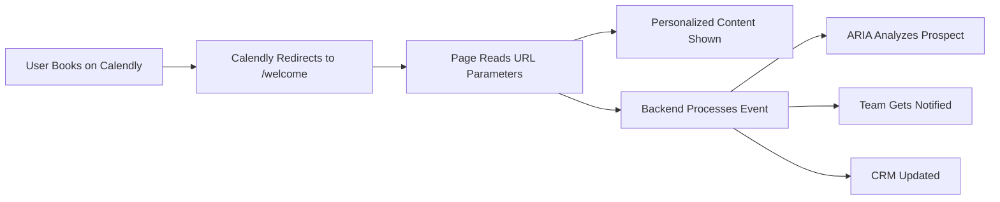

# Calendly Welcome Page Integration

This guide explains how to integrate the personalized welcome page with your Calendly scheduling flow using a single, constant URL.

## Overview

When someone schedules a call through Calendly, they're redirected to a personalized welcome page that:
- Greets them by name using Calendly's event data
- Shows their role based on screening questions
- Displays music industry insights
- Demonstrates ARIA agent capabilities
- Triggers agentic workflows in the background

## The Single URL Approach

Based on Calendly's v2 API and the [BuzzwordCRM example](https://github.com/calendly/buzzwordcrm), we use a single redirect URL and let Calendly append event details as parameters.

### Calendly Configuration

1. Go to **Event Settings** → **Confirmation Page**
2. Select **Redirect to an external site**
3. Use this single URL:
   ```
   https://www.patchline.ai/welcome
   ```
4. Check **"Pass event details to your redirected page"**

That's it! Calendly will automatically append these parameters:
- `invitee_full_name` - The person's full name
- `invitee_email` - Their email address
- `event_type_name` - The type of meeting scheduled
- `scheduled_event_uuid` - Unique event identifier
- `event_start_time` - When the meeting is scheduled
- `questions_and_answers` - Responses to screening questions

## How It Works

### 1. Event Flow


### 2. URL Parameters Calendly Sends

Example redirect URL:
```
https://www.patchline.ai/welcome?invitee_full_name=John%20Doe&invitee_email=john@example.com&event_type_name=Discovery%20Call&scheduled_event_uuid=abc123
```

### 3. Backend Processing

The welcome page triggers an API call to process the event:

```typescript
// Triggered automatically when page loads
await fetch('/api/calendly/process-event', {
  method: 'POST',
  body: JSON.stringify({
    eventId: 'abc123',
    inviteeName: 'John Doe',
    inviteeEmail: 'john@example.com',
    eventType: 'Discovery Call'
  })
})
```

This endpoint:
1. Stores event details
2. Triggers ARIA to analyze the prospect
3. Notifies your team
4. Updates your CRM
5. Schedules follow-up tasks

## Agentic Workflows

### ARIA Analysis
When someone books, ARIA automatically:
- Analyzes their role and background
- Prepares personalized talking points
- Identifies relevant features to demo
- Suggests optimal meeting flow

### Team Notifications
The system can:
- Send Slack notifications with prospect analysis
- Create tasks in your project management tool
- Update your CRM with enriched data
- Send personalized follow-up emails

## Advanced Features

### 1. Screening Questions
Add screening questions in Calendly to gather more data:
- "What's your role in the music industry?"
- "What challenges are you looking to solve?"
- "How did you hear about us?"

These appear in the `questions_and_answers` parameter.

### 2. Role Detection
The system automatically detects roles:
- **Engineer**: Shows technical architecture
- **Artist**: Highlights playlist opportunities
- **Manager**: Emphasizes time-saving features
- **Label Exec**: Focuses on A&R automation
- **Investor**: Displays growth metrics

### 3. Dynamic Content
Based on the detected role, the page shows:
- Personalized ARIA messages
- Relevant success metrics
- Targeted call-to-actions
- Industry-specific insights

## Testing

To test locally, visit:
```
http://localhost:3000/welcome?invitee_full_name=Test%20User&invitee_email=test@example.com&event_type_name=Demo%20Call
```

## Security Considerations

1. **No Authentication Required**: The page is public but shows only general information
2. **Email Validation**: Backend validates emails before processing
3. **Rate Limiting**: API endpoints are rate-limited
4. **Data Privacy**: Personal data is processed securely

## Customization Options

### Visual Elements
- Confetti colors in `colors` array
- Industry stats in `INDUSTRY_STATS`
- Success metrics in `SUCCESS_METRICS`

### Agent Messages
Customize role-specific messages in the `messages` object:
```typescript
const messages = {
  engineer: "Technical message...",
  artist: "Artist-focused message...",
  // etc.
}
```

### Workflows
Extend the `processCalendlyEvent` function to:
- Send to different CRMs
- Trigger custom webhooks
- Start email sequences
- Create calendar events

## Best Practices

1. **Keep It Fast**: Page loads quickly even with processing
2. **Graceful Fallbacks**: Works even if parameters are missing
3. **Mobile Responsive**: Optimized for all devices
4. **Error Handling**: Fails gracefully if APIs are down

## Future Enhancements

- [ ] Webhook endpoint for real-time Calendly events
- [ ] A/B testing different welcome messages
- [ ] Integration with more CRM systems
- [ ] Advanced analytics tracking
- [ ] Multi-language support
- [ ] Custom branding per event type

## Troubleshooting

**Issue**: No personalization showing
- **Solution**: Check if Calendly is passing parameters (check URL)

**Issue**: Backend processing fails
- **Solution**: Check API logs, ensure endpoints are accessible

**Issue**: Wrong role detected
- **Solution**: Review screening questions and detection logic 